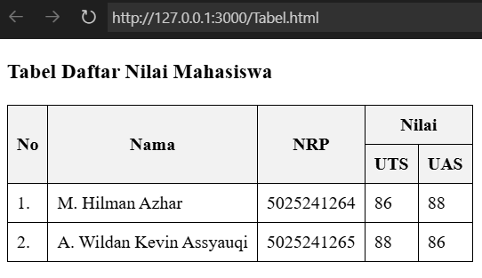
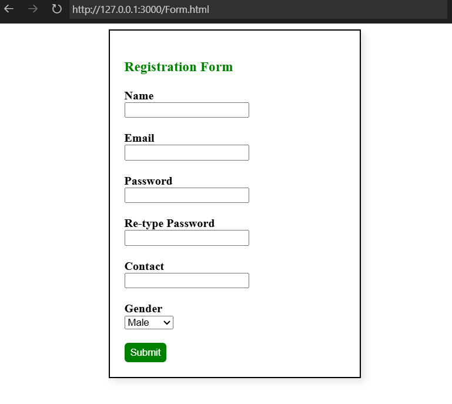
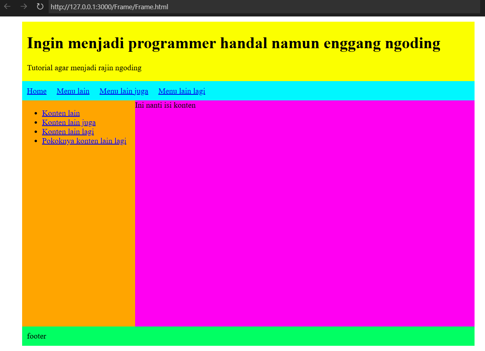

# Tugas 2 - Pemrograman Web B

## Deskripsi
Assalamualaikum Wr. Wb., pada kuliah pertemuan ketiga pada tanggal (08 September 2025) dalam kelas Pemrograman Web Kelas B 
Saya ditugaskan untuk membuat kode Tabel, Form, dan Frame menggunakan HTML

## Preview
### Preview tabel

Kode dapat diakses [di sini](https://github.com/wildankev/pweb-b-2/blob/main/tabel.html)

### Preview Form registrasi

Kode dapat diakses [di sini](https://github.com/wildankev/pweb-b-2/blob/main/form.html)

### Previe Frame

Kode dapat diakses [di sini](https://github.com/wildankev/pweb-b-2/blob/main/frame/)

---
## Identitas
- **Nama**: A. Wildan Kevin Assyauqi  
- **NRP**: 5025241265  
- **Kelas**: Pemrograman Web - B
